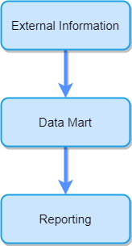

## Data Warehouse

A Data Warehouse is a collection of data oriented to a certain area (be it a company, organization, etc.) integrated, non-volatile and variable over time, used for decision-making in the area in which its being used. Data Warehouses are a core component of Business Intelligence. DWs are central repositories of integrated data from one or multiple sources.

### Data Warehouse Features

- **Subject Oriented:** All data in a data warehouse is organized in such a way that all data items are related to the same topic in real life.
- **Non-volatile:** All the data in a data warehouse will never be removed or deleted, always stay no matter what.
- **Integrated:** The data stored in a data warehouse has to be related to each other and be integrable.
- **Time variant:** Data warehouses vary through time and grows in size.

### Goals of Data Warehouses and Business Intelligence

- Data Warehouses systems must make information easily accessible, the content must be understandable, intuitive and obvious to the business user, not merely the developer.
- Data Warehouses systems must present information in a consistent manner. The data in DWs systems must be credible, high quality and carefully assembled.
- Data Warehouses systems must adapt to change. As user needs change DWs systems need to adapt and handle the new requirements. DWs Systems must be designed to handle change gracefully so it doesn't invalidate existing data or applications.
- Data Warehouses systems must present data in a timely manner.
- Data Warehouses systems must serve as a reliable foundation for improved decision making.
- The business user must accept the Data Warehouse system to deem it successful.
- Data Warehouse systems must be secure and protect the information assets.

### Data Marts

A data mart is a data warehouse oriented to a specific area of business within the organization. This allows the organization to access key data in an area in a simple way, in addition to performing various functions such as:

- Organize the information for further analysis
- Development of key performance indicators (KPI)
- Creating reports for machine learning
- Evaluation of data on the achievement of objectives

> A data mart is a query-oriented system that is normally fed by batch data loading processes.

## Dimensional Modeling Introduction

Dimensional modeling is the preferred technique for presenting analytic data because it delivers data in an understandable manner to business users and deliver fast query performance. Although dimensional models are often instantiated in database management systems, they are different from third normal form (3NF also known as entity-relationship or ER) models which seek to remove data redundancies.
3NF models and dimensional models can both be represented in Entity-relationship diagrams (ERD) because both consist of joined relational tables; The key difference between the two is the degree of normalization.

> A dimensional model contains the same information as a normalized model, but packages the data in a way that the user can understand it and provides better query performance and resilience to change.

### Star Schema

In databases used for data warehousing, a star schema is a data model that has a fact table that contains data for analysis, surrounded by dimension tables. We refer to this scheme as star because of its resemblance to a star-like structure.
The star schema divides the business process data into facts (metrics) and dimensions. The facts contain quantitative measurable data related to the business transaction and the dimensions are attributes that describe the data indicated in the facts (a kind of meta-data that describes other data).

#### Fact table

A fact table records measurements or metrics of a specific event. Fact tables are designed to contain uniform low-level details (referred to as granularity), meaning that facts can record events at a high level of automation. A fact table can be one of the following types:

- Transactional fact table
- Snapshot fact table
- Cumulative snapshot fact table

> Fact tables are generally assigned a surrogate key, to ensure that each row can be uniquely identified.
>
> Surrogate Key: A surrogate key or artificial key is a unique identifier for entity or object in the database. The surrogate key does not derive from data in an application.

#### Dimension Tables

Dimension tables generally have a low number of records, compared to fact tables, but each record can have a large number of attributes to describe the fact data.

### OLAP Schema

#### OLAP Considerations

• A star schema is a good foundation for building an OLAP cube.
• OLAP have better performance over RDBMSs.
• OLAP data structures vary between different vendors.
• OLAP cubes offer more sophisticated security option than RDBMSs.
• OLAP cubes may need to be reprocessed when overwriting data or changing dimensions.
• OLAP cubes support transaction and periodic snapshot fact tables.
• OLAP cubes support complex hierarchies of indeterminate depth.
• Some OLAP products do not enable dimensional roles or aliases.

> Ralph Kimball recommends using a star schema instead of OLAP technologies because OLAP technologies are not mature enough and the star schema is easier for the designer and the end user to understand.
