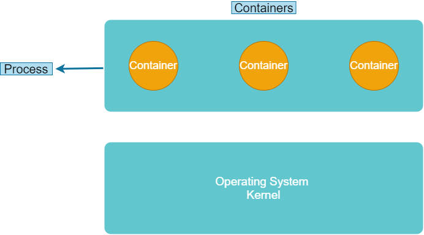
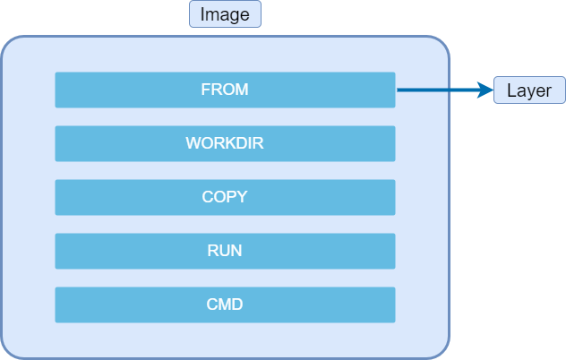
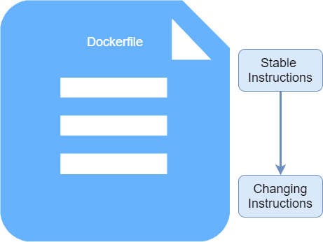

# Docker

## What is Docker?

Docker is an open-source project that allows the user to automate application deployment using software containers, providing an additional layer of abstraction and virtualization automation of applications across multiple operating systems.

Docker uses the resource isolation feature of the Linux kernel, such as cgroups and namespacces. This allows docker “containers” to run independently within a single Linux instance, thus avoiding the overhead of starting and maintaining virtual machines.

Docker solves the problem of the same software not working or behaving the same in different environments. Docker also allows us to run multiple applications with different versions of the same software in parallel without creating conflicts. This is achieved by running the applications in isolation

## Virtual Machines vs Containers

A **container** is an isolated environment to run an application. It is essentially an operating system process with its own file system. Containers are running instances of an image.

A **virtual machine** is an abstraction of hardware resources. These are created using hypervisors.

A virtual machine allows us to run applications in isolation. With the disadvantage that each virtual machine needs a complete operating system and a part of the available resources. This makes each virtual machine consume much more resources and its startup is slow. On the contrary, the containers are very light and start quickly since they share the Host’s kernel (which is already started).

## Docker Architecture

Docker uses a client/Server architecture. Docker has a component that talks to the server using a RESTful API. This “server” is known as the Docker Engine (or daemon). The server runs in the background and is responsible for doing the heavy lifting.



> Windows 10 includes the Linux kernel in addition to the windows kernel. So we can run Linux applications natively on windows.

## Installing Docker

You can download docker from [here](https://docs.docker.com/get-docker/).

## Docker Images

An image is a template that contains instructions with which you can create a Docker container. Often an image is initialized with another image with some additional settings.

An image is a kind of snapshot or template of a virtual machine, but much lighter.

```shell
> docker build -t [Name]     # Build an image
> docker images              # See all images
> docker image ls            # See all images
> docker run -it [Image] sh  # Run a shell session of a container.
```

### An image usually includes:

- A lightweight operating system.
- A runtime environment.
- Application files.
- Third party libraries.
- Environment variables, etc.

## Workflow

With Docker we can package an application in an image, once we have an image it can be run on any machine that has docker. El registro de docker más popular es [DockerHub](https://hub.docker.com/).

To package an application we must add a `Dockerfile`, this plain text file includes the instructions to package the image.

### Dockerfile

A `Dockerfile` is a configuration file used to create images. This file indicates what the image will contain and the various commands that will be used to install the different tools used by the image.

```dockerfile
# Basic Node Dockerfile
FROM node:14.17.0-alpine3.13
WORKDIR /my_app
COPY . .
RUN npm install
EXPOSE 8000
ENTRYPOINT ["npm", "start"]
```

### Dockerfile Instructions

- **FROM:** Specifies the base image. A base image does not have a parent image specified in its dockerfile. It is created using the `FROM scratch` directive.

- **WORKDIR:** Sets the working directory from any `RUN`, `CMD`, `ENTRYPOINT`, `COPY` and `ADD` instruction.

- **COPY:** This instruction copies new files/directories from `<src>` and adds them to the filesystem of the container at the path `<dest>`.

- **ADD:** This instruction copies new files/directories or remote URLs from `<src>` and adds them to the path `<dest>`.

- **RUN:** This instruction will execute any command in a new layer on top of the current image and commit the results. The result image will be used in the next step in the `Dockerfile`.

- **ENV:** Sets the environment variable `<key>` to the value `<value>`. This value will be in the environment for all the subsecuent instructions in the building process.

- **EXPOSE:** Informs Docker that the container listens on the specified network port at runtime. This instuction does not pubhlish the port automatically on the host, it only works as a form of documentation.

- **USER:** Sets the user name (or UID) and optionally the user group (or GID) to use when running the image and for any `RUN`, `CMD`, `ENTRYPOINT` instruction that follow it in the `Dockerfile`.

- **CMD:** This instruction specifies a command or executable to be executed at run time. If omitted an `ENTRYPOINT` instruction must be used.

- **ENTRYPOINT:** This instruction allows you to configure a container that will run as an executable.

## Optimizing Docker builds

Docker images work through layers, a layer works as a filesystem that only includes modified files.



We can imagine each instruction in the `Dockerfile` as a new layer. The layers can be seen with the `history` instruction.

```shell
> docker history [Image]
```

> History is read from bottom to top.

Docker has an optimization mechanism included. When rebuilding an image, Docker checks each instruction to see if its conten has changed or not. If it hasn't changed, Docker doesn't rebuild the layer, it just reuses it from its cache.

To optimize the construction of containers we must organize our `Dockerfile` in such a way that the instructions that do not change frequently are above the instructions or files that change frequently.



## Tagging Images

Docker tags are simply lables that provide a better way to manage versioning and realeses. Instead of referencing an image by ID, ou can refer to it using tags. This tag can be a codename or a semantic version control.

Creating a tag is easy, to do it we use the `docker tag` instruction. You can also add a tag during container construction with the `-t` flag.

```shell
> docker build -t [Image]:[Tag] .
> docker image tag [Image]:[Current Tag] [Image]:[New tag]
> docker image tag [ID] [Image]:[Tag]
```

### Latest doesn't always mean "latest"

The label "latest" tends to be a bit confusing, despite his meaning. It does not always point to the latest version of an image. It's just automatically applied to images for which we don't specify a tag.

## Sharing Images

To publish an image on DockerHub we must follow the following steps:

1. Create the repository in [DockerHub](https://hub.docker.com/repository/create) .

2. Make sure the image matches the name of the repository.

```shell
# Rename Image
> docker image tag [ID] [New name]:[Tag]
```

3. Login to Docker.

```shell
# Login to Docker
> docker login
```

4. Publish the image.

```shell
# Push image to DockerHub
> docker push [Name]:[Tag]
```

## Saving images in compresed files

We can save images as compressed files to share them without using DockerHub.

```shell
# Save image into a .tar file
> docker image save -o [Name].tar [Image]
```

To load these compressed files into an image we use the `load` instruction.

```shell
# Load image from .tar file
> docker image load -i [Name]
```

## Containers

### Starting Containers

When creating a new container, docker assigns a unique name to each ocntainer or UUID (Universally Unique Identifier).We can give our container a name using the `--name` flag.

```shell
> docker run -d --name [UUID] [Image]
```

### Container Logs

The `docker logs` instruction shows the logs present at runtime.

```shell
> docker logs [container]       # See logs
> docker logs -f [container]    # Follow logs
> docker logs -t [container]    # See logs with timestamps
> docker logs -n 10 [container] # See the last 10 lines
```

### Publishing Ports

There are two ways to publish ports in docker. Using the `-P` or `-p` flag. Using the flag `-P` (uppercase) we can publish all the ports that have been exposed in random order on the host interface. Using the flag `-p` (lowercase) we can publish a specific port of the contaner in a port of the host.

```shell
# Publish a specific port
> docker run -p [Host port]:[Container port]
```

### Executing commands in a runing container

The `docker exec` instruction allows us to execute a commant ina running container.
The difference between `exec` and `run` is that `run` starts a new container, while `exec` executes a command in a running container.

```shell
> docker exec [Container] [Command] # Run a command
> docker exec -it [Vontainer] sh    # Start an interactive shell
```

### Working with containers

```shell
# Starting and stopping containers
> docker stop [Container]
> docker start [Container]
```

```shell
# Listing containers
> docker ps    # List running containers
> docker ps -a # List all containers
```

```shell
# Removing containers
> docker rm [Container]    # Remove container
> docker rm -f [Container] # Force removal
> docker container prune   # Remove all stopped containers
```

### Volumes

Volumes are mechanisms that allows us to preserve data generated and used by docker containers. Volumes can be directories on the host or can be stored in the cloud.

```shell
> docker volume ls                         # List volumes
> docker volume create [Name]              # Create new volume
> docker volume inspect [Name]             # Inspect volume
> docker run -v [Container]:[Path] [Image] # Create container with volume
```
