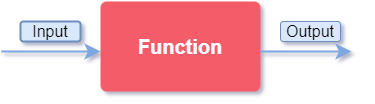
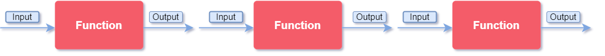

# Functional programming using JavaScript

In computer science, functional programming is a declarative programming paradigm based on the use of true mathematical functions. In this programming style, functions are first class citizens; functions expressions can be assigned to variables like any other value.

Functional programming is based on decomposing problems in small and reusable functions that take an input and returns a result. These functions don’t mutate or transform data.



With this structure we can compose more complex functions. These functions tend to be more concise, easier to debug and are more scalable.



## Functions as first-class citizens

We say an entity is a first-class citizen when a given entity (like a function) supports all the operational properties inherent to other entities; properties such as being assigned to a variable, being sent as an argument of a function, being returned by another function etc.

In a nutshell, being a first-class citizen means “being able to do what everyone else can do”.

```javascript
// Basic function in JavaScript
function sayHello() {
  return "Hello World";
}

// Reference to a function
let fn = sayHello;

// Function as a parameter
function greet(fnMessage) {
  console.log(fnMessage());
}

// Function as an argument
greet(sayHello);

// Function as a result
function sayHello2() {
  return function () {
    return "Hello Again";
  };
}
```

## High Order Functions

High order functions are functions that operate in other functions, either by using them as an argument or returning them as a result.

```javascript
// map is a high order function
let numbers = [1, 2, 3];
numbers.map((number) => number * 2);
```

## Function composition

Function composition is the process of combining two or more functions to produce a new function. You can think of these functions as pipes that our data will pass through.

The composition of a function **_f_** and a function **_g_** can be defined as **_f(g(x))_**.

```javascript
// Simple solution
let input = 10;
let output = "'" + (input * 2).toString() + "'";
console.log("output :>> ", output);

// Using functional programming
const multiply = (num) => num * 2;
const wrap = (str) => `'${str}'`;
const result = wrap(multiply(input).toString());
console.log("output :>> ", result);
```

## Currying

Currying is a functional programming technique in which we can transform a function with multiple arguments in a sequence of nested functions. This sequence returns a function that expects the next argument in line. This process continues until all arguments are used and are been executed in the final function.

Let's see the following function that adds two numbers.

```javascript
// Simple solution
function add(a, b) {
  return a + b;
}
console.log("output :>> ", add(2, 2)); // 4

// Using Currying
function add2(a) {
  return function (b) {
    return a + b;
  };
}
console.log("output :>> ", add2(2)(2)); // 4

// Currying with arrow functions
const add3 = (a) => (b) => a + b;
console.log("output :>> ", add3(2)(2)); // 4
```

## Pure functions

Pure functions are functions that receive an argument and return a result without modifying any data out of his scope; in other words, they are functions without side effects.

The output value depends only in its input value. A pure function must always return a value.

### Pros:

- They are self-documented functions
- Makes testing easier.
- Can be executed in concurrency.
- The output can be stored in cache.

### Cons:

- They can’t use random values.
- They can’t use the current date/time.
- They can’t change the global state.
- They can't modify their parameters.

## Immutability

We say something is immutable when it can't be modified. In the context of programming, a variable is immutable when its value can’t be modified. And an object is immutable when its state cannot be updated after its creation.

Immutability is a way to reassure out object doesn't get updated in unexpected places.

> When using const in JavaScript we are not creating an immutable object, we are creating an object that cannot be reassigned.
