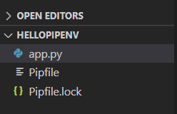
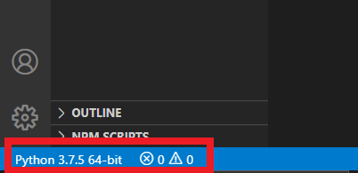
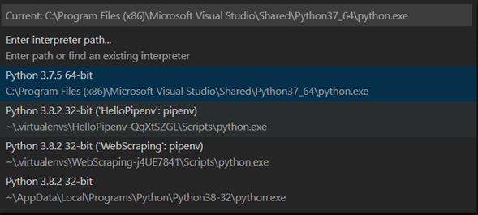

# Setup Pipenv

Pipenv is a tool that implement the capabilities of packaging tools (such as bounder, composer, npm, cargo, yarn among others) in python.
Pipenv creates and manage virtual project environments automatically. Creates/ removes packages from pipfile as packages are installed/uninstalled.

## Installation

First, we need to locate ourselves in the main directory of the project. Once there we can install pipenv.

#### Windows

```bash
> pip install pipenv
```

#### Linux / Mac

```bash
> pip3 install pipenv
```

Once pipenv is installed we can install package as follows:

```bash
> Pipenv install [Package_name]
```

Now that we installed our first module, several things will happened, the first one is the creation of the pipfile and the pipfile.lock. This also create a new virtual environment and install our package within this virtual environment.



To know where our virtual environment is located, it is necessary to use the following command:

```bash
> Pipenv --venv
```

The reason why this virtual environment is not located in our project directory is to avoid increasing the size of the project unnecessarily.

## Usage

To run our project, we need to use the pipenv shell

```bash
> Pipenv shell
> Python -u [project name]
```

If you want to exit the pipenv shell, you can use:

```bash
> Exit
```

If you want to create the requirements.txt of a virtual environment you use:

```bash
> pipenv lock -r > requirements.txt
```

## CodeRunner

If you try running your project with code runner it will create an import request error. This is because code runner is trying to run your project with the default python interpreter.
The python extension for VS Code automatically looks for interpreters on the following location:

- Standard install path
- Virtual environments located directly under workspace (project) folder
- Virtual environments located in the folder identified by python.venvPath
- Virtual environments located in ~/.virtualenvs folder
- Interpreters installed by pyenv
- Virtual environments locatd in the path identified by WORKON_HOME
- Conda environments that contain a Python interpreter
- Interpreters intalled in a .direnv folder

To use pipenv with coderunner we need to add it manually like this:

1. Go to settings
2. Open your settings.json
3. Go to “code-runner.executorMap”, if you haven’t configure it yet, just use the key to set it up.
4. Go to the python path and replace it with the following:

```json
"python": "$pythonPath -u $fullFileName"
```

Now Code Runner will use the path specified in VSCode. To change it to the bottom left corner of your editor, click on the python version and it will display the current paths that you have available.





If you can't find the path you are looking for, you can add it manually on the settings.json like this:

```bash
> python.pythonPath": "[Path]"
```
