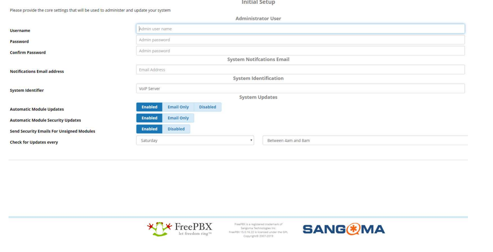

# Seting up a PBX on a Raspberry Pi

VoIP is the acronym for the voice over Internet Protocol. This is a methodology and gropup of technologies for shipping and reception of voice and multimedia communication over IP networks, such as the internet.

## Prerequisites

- [Raspberry Pi](https://www.raspberrypi.org/)
- [RasPBX](http://www.raspberry-asterisk.org/)
- [ZoiPer](https://www.zoiper.com/)
- [Etcher](https://www.balena.io/etcher/)
- [Putty](https://www.putty.org/)
- Ethernet Cable

## Instalation

We start with the isntallation of the PBX server, for this we will use Etcher, it is a tool that allows us to flash the image on a MicroSD in 3 steps:

- Select the image
- Select the drive
- Flash


Once we finished, we can insert the MicroSd on the Rpi and hook it to our local network.
Now we can connect to the Rpi with Putty via SSH.


To start the SSH communication we need to log in, the default credentials for RasPBX are:

```bash
User: root
Pasword: raspberry
```


Before we start seting up our PBX we need to update our RasPBX version and install Fail2Ban.


Now we can access the dashboard and configure our SoftPhone extensions. The default host is: http://raspbx.local. The first time you access the dashboard you will see a configuration page, here you will setup your user credentials and select a server name.



Once you finished seting up your user, you can log in.


## Setting up custom Extensions

To configure your own extensions go to the Applications tab on the Nav Bar, here you can create your new extension.


## Setting up SoftPhones

Using ZoiPer you can make calls with the extensions you previosly made. To log in on ZoiPer you will need to provide some information:

- Username: The extension you want to use
- Password: Password provided by FreePBX


ZoiPer will ask for the hostname, we will use the server IP as our host.


We will skip the optional authentication and proxy, finally ZoiPer will detect the PBX configuration.


Now that we finished setting up ZoiPer, we can make calls using the extensions of our users.


