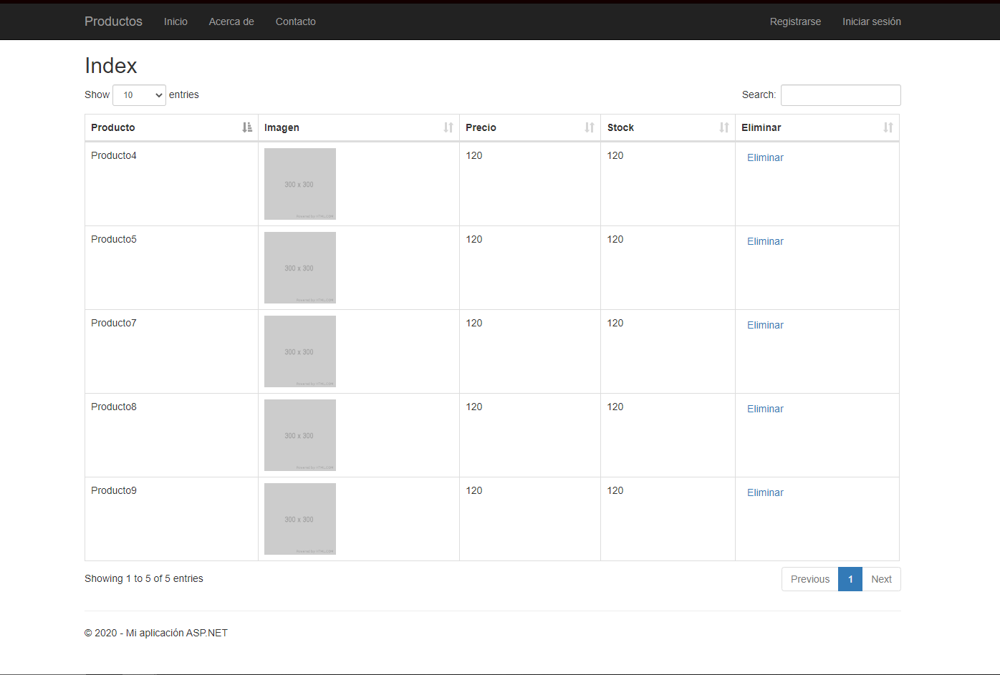

# Real Time Product Section

Product section of store that updates in real time.

## Software Used

- MVC5
- SignalR
- Bootbox
- DataTables
- Entity Framework

## Setup

**SignalR**

```shell
> Install-Package Microsoft.AspNetCore.SignalR
```

**Bootbox**

```shell
> Install-Package Bootbox -version:4.3.0
```

**DataTables**

```shell
> Install-Package jquery.DataTables -version:1.10.11
```

**Entity Framework**

```shell
> Enable-Migrations
> Add-Migration [ModelName]
```

## Overview

This project uses SignalR to create a real-time web application with ASP.NET MVC5. The product section updates every time a product is deleted.
To display products it uses DataTables for pagintation, and bootbox for displaying on screen messages.



## Enable SignalR

1. Startup.cs

```csharp
using Microsoft.Owin;
using Owin;

[assembly: OwinStartupAttribute(typeof(RealTimeProducts.Startup))]
namespace RealTimeProducts
{
    public partial class Startup
    {
        public void Configuration(IAppBuilder app)
        {
            app.MapSignalR();
            ConfigureAuth(app);
        }
    }
}
```

2. \_Layout.cshtml

```javascript
@Scripts.Render("~/bundles/lib")
<script src="~/Scripts/jquery.signalR-2.4.1.min.js"></script>
<script src="~/signalr/js"></script>
@RenderSection("scripts", required: false)
```

3. index.cshtml (Product)

```javascript
$.connection.hub
  .start()
  .done(function () {
    console.log("SignalR: Connected");
  })
  .fail(function () {
    alert("Error!");
  });

$.connection.myHub.client.announce = function (message) {
  console.log(message);
  location.reload();
};
```
